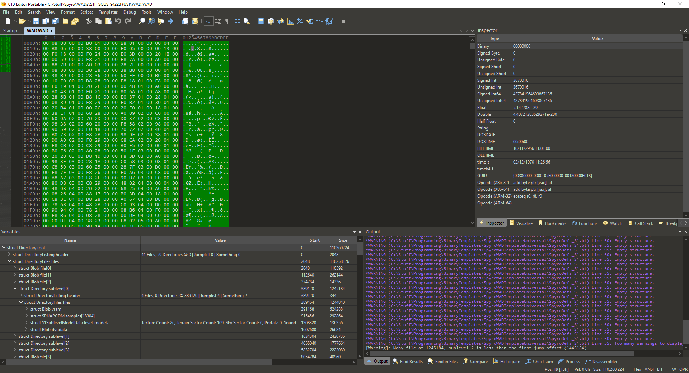
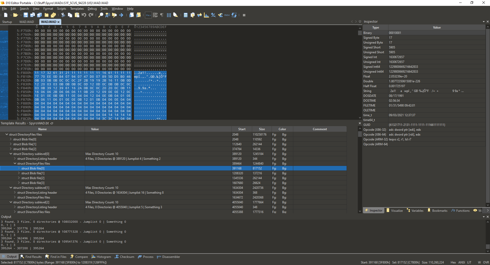

# Requirements 
- You'll need a copy of the hex editor 010 Editor, there is also a portable trial version for Windows - a 30 day free trial is here: https://www.sweetscape.com/010editor/
You need at least v12.0.1.
- You will want a `WAD.WAD` file of your choosing, from either Spyro 1, 2, or 3. This does NOT include `PETE.WAD` present in some early demo versions.
------
# Once in 010 Editor
First, open your `WAD.WAD` file:
>*CTRL+O*
*File -> Open File*

Then, use either to open the `SpyroWAD.bt` file:
>*CTRL+F5*
*Templates -> Open Template*

If you opened a Spyro 2 or 3 WAD, you'll want to change the line at the very end of `SpyroWAD.bt`:

`Directory root(GAME_SPYRO_1, DIRECTORY_ROOT);`

You can change GAME_SPYRO_XXXX to the following game types:
```C
enum GameType {
	GAME_SPYRO_1_US,
	GAME_SPYRO_1 = GAME_SPYRO_1_US,
	GAME_SPYRO_1_EU,
	GAME_SPYRO_1_JP, // Same as EU?
	GAME_SPYRO_2,
	GAME_SPYRO_3
};
```

Finally, run the template on the `WAD.WAD` using:
>*F5*
>*Templates - Run Template*

You should see something similar to the following:


The tree near the bottom in this case is the output of the template.


-------
This is still a massive work in progress, and honestly I get confused with the binary template code sometimes, and move stuff around a lot, but ultimately the output/format is what matters for now.

Next on my list TODO is mapping out the binary file blobs for each game, but I also wanted to take a look at the (level data? overlays?) that lie before the level files and mess with them.